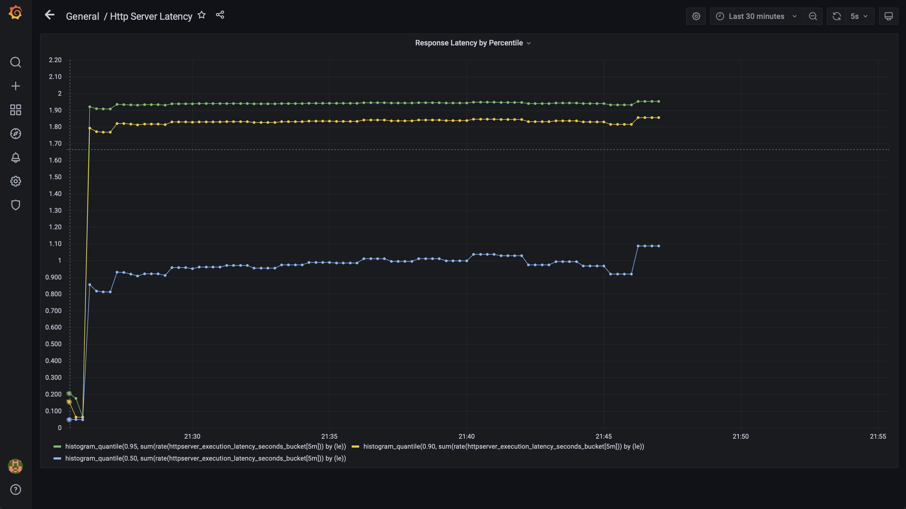

# HTTPServer添加Metrics功能实验
## 修改httpserver项目代码
参考老师的代码实现，添加`/metrics`接口，在`/hello/golang` 接口添加随机Sleep时间，模拟业务处理耗时。以下为main.go修改之处，metrics.go采用老师的实现。

```bash
package main

import (
	//...
	"httpserver/metrics"
)

func main() {
	//...
	//注册metrics
	metrics.Register()

	mux := http.NewServeMux()
	mux.HandleFunc("/", handleRequest)
	//发布metrics
	mux.Handle("/metrics", promhttp.Handler())

	//...
}

func handleRequest(w http.ResponseWriter, r *http.Request) {
	//...
	//处理地址路由
	var statusCode int
	if r.URL.Path == "/hello/golang" {
		statusCode = helloGolang(w, r)
	} else if r.URL.Path == "/healthz" {
		statusCode = healthz(w, r)
	} else {
		statusCode = http.StatusNotFound
	}
	//...
}

func helloGolang(w http.ResponseWriter, r *http.Request) int {
	glog.V(4).Info("entering hello Golang handler")
	//设置延时
	timer := metrics.NewTimer()
	defer timer.ObserveTotal()
	delay := randInt(10,2000)
	time.Sleep(time.Millisecond*time.Duration(delay))

	io.WriteString(w, "Hello, Golang!")
	glog.V(4).Infof("Respond in %d ms", delay)
	return http.StatusOK
}

func randInt(min int, max int) int {
	rand.Seed(time.Now().UTC().UnixNano())
	return min + rand.Intn(max-min)
}

```
## 修改部署脚本
修改httpserver镜像的tag为v1.2并重新上传，在k8s部署脚本里面添加prometheus的Label，`prometheus.io/scrape`和`prometheus.io/port` 。

```yaml
apiVersion: apps/v1
kind: Deployment
metadata:
  name: httpserver-deployment
spec:
  replicas: 1
  selector:
    matchLabels:
      app: httpserver
  template:
    metadata:
      annotations:
        prometheus.io/scrape: "true"
        prometheus.io/port: "8080"
      labels:
        app: httpserver
    spec:
      terminationGracePeriodSeconds: 60
      containers:
        - name: httpserver
          image: wadedc/httpserver:v1.2
          env:
            - name: VERSION
              valueFrom:
                configMapKeyRef:
                  key: VERSION
                  name: httpserver-config
          resources:
            limits:
              memory: 1Gi
              cpu: '1'
            requests:
              memory: 256Mi
              cpu: 100m
          readinessProbe:
            httpGet:
              port: 8080
              path: /healthz
            initialDelaySeconds: 30
            periodSeconds: 5
            failureThreshold: 5
            successThreshold: 1
          livenessProbe:
            httpGet:
              port: 8080
              path: /healthz
            initialDelaySeconds: 60
            periodSeconds: 5
            failureThreshold: 5
            successThreshold: 1
---
apiVersion: v1
kind: Service
metadata:
  name: httpserver-service
spec:
  type: NodePort
  ports:
    - port: 8080
      protocol: TCP
      name: http
  selector:
    app: httpserver
---
apiVersion: v1
kind: ConfigMap
metadata:
  name: httpserver-config
data:
  VERSION: 1.17.1
```
在K8S集群中进行部署

```bash
[root@k8s-master1 loki]# kubectl get deploy httpserver-deployment
NAME                    READY   UP-TO-DATE   AVAILABLE   AGE
httpserver-deployment   1/1     1            1           52m
[root@k8s-master1 loki]# kubectl get svc httpserver-service
NAME                 TYPE       CLUSTER-IP      EXTERNAL-IP   PORT(S)          AGE
httpserver-service   NodePort   10.96.106.215   <none>        8080:32015/TCP   53m
```
## 部署loki-stack
修改helm脚本以适应高版本k8s

```bash
grep -rl "rbac.authorization.k8s.io/v1beta1" . | xargs sed -i 's/rbac.authorization.k8s.io\/v1beta1/rbac.authorization.k8s.io\/v1/g'
```
用helm部署loki

```bash
helm upgrade --install loki ./loki-stack --set grafana.enabled=true,prometheus.enabled=true,prometheus.alertmanager.persistentVolume.enabled=false,prometheus.server.persistentVolume.enabled=false
```
完成部署

```bash
[root@k8s-master1 loki-stack]# kubectl get deploy | grep loki
loki-grafana                   1/1     1            1           87m
loki-kube-state-metrics        1/1     1            1           87m
loki-prometheus-alertmanager   1/1     1            1           87m
loki-prometheus-pushgateway    1/1     1            1           87m
loki-prometheus-server         1/1     1            1           87m
```
## 创建一个 Grafana Dashboard 展现延时分配情况


